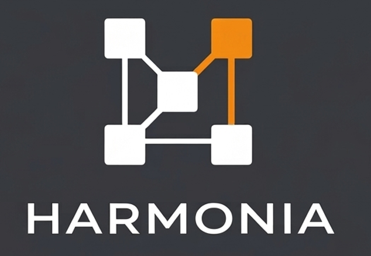
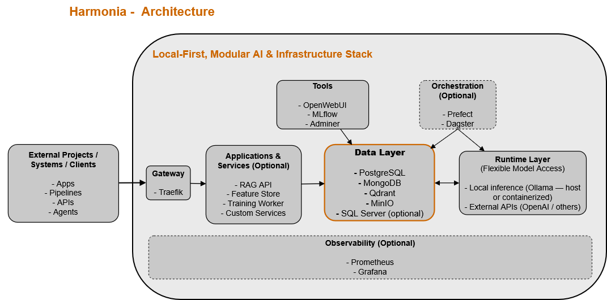

# Harmonia — Local-First AI Infrastructure Stack

<p align="center">
  
</p>

<p align="center">
  <strong>A modular, containerized environment for building, testing, and benchmarking AI systems locally</strong>
</p>


## Overview

Harmonia is a local-first AI infrastructure stack for engineers who want working AI services quickly, without wiring them together by hand.

**Project Status**

Current focus: local-first AI infrastructure for rapid prototyping, validation, and reusable experimentation workflows.

It packages the core services commonly used in:

- RAG pipelines  
- MLOps workflows  
- data engineering  
- agentic systems  
- LLM experimentation  

The repository is built around Docker Compose, a unified local gateway, and reusable shared services that external projects can connect to directly.

## What This Repo Demonstrates

- Docker Compose service composition
- Traefik-based local routing
- Reproducible local AI workflow infrastructure

## Runnable Examples

The repository includes two quick examples that show the stack working in practice:

- [`examples/mlflow-demo`](examples/mlflow-demo/README.md) -> local experiment tracking with MLflow
- [`examples/rag-demo`](examples/rag-demo/README.md) -> local retrieval workflow with Qdrant and Ollama

Start the stack, open an example, and run the notebook end to end.

Related article: [The Hidden Tax of Every AI Project](https://medium.com/@kyrJian/the-hidden-tax-of-every-ai-project-rebuilding-the-same-environment-1c97a8e4a5a0)

## Start in 60 Seconds

From the repository root:

Default stack:

```powershell
.\scripts\windows\start.ps1
```

Developer stack with direct localhost data access:

```powershell
.\scripts\windows\start-dev.ps1
```

Then open:

- `http://ai.localhost`

Useful follow-ups:

- `.\scripts\windows\list-urls.ps1` -> show active URLs
- `.\scripts\windows\status.ps1` -> show running services

If PowerShell blocks scripts:

```powershell
Get-ChildItem .\scripts\windows\*.ps1 | Unblock-File
```

---

## Why “Harmonia”

The name *Harmonia* reflects the goal of the stack: bringing storage, retrieval, runtime, tracking, and tooling into one consistent local environment without tightly coupling them.

Modern AI work is rarely just a model. It is a set of moving parts that need to work together reliably enough to support experimentation, reuse, and iteration.

---

## What You Get

Running this stack provides a complete local AI and data environment with:

- relational, document, and vector databases  
- object storage for datasets and artifacts  
- experiment tracking (MLflow)  
- local LLM inference via Ollama or external APIs  
- optional workflow orchestration  
- optional monitoring and observability  

Services are exposed through a unified gateway and can be combined into end-to-end local AI workflows.

---

## Stack in Action

The following screenshot shows the stack running locally, including the gateway-routed entry point and attached services.

### Stack Dashboard


Unified entry point to the services exposed through Traefik.


---

## Key Capabilities

- Modular AI and data infrastructure layout  
- Self-hosted storage, vector search, and artifact infrastructure  
- Experiment tracking and model lifecycle support  
- Local LLM runtime with CPU/GPU or external API options  
- Workflow orchestration and pipeline execution  
- Monitoring and observability support  

---

## Typical Workflow

A typical usage flow looks like:

1. Start the stack using the provided scripts  
2. Connect an external project (e.g. RAG, ML pipeline, or API service)  
3. Use the available services:
   - MLflow for experiment tracking  
   - Qdrant for vector search  
   - PostgreSQL for structured data  
   - MinIO for artifacts  
   - Ollama (or external APIs) for LLM inference  
4. Iterate and experiment locally  
5. Promote validated workflows to cloud or production environments  

This supports local development, validation, and benchmarking without requiring cloud infrastructure.

---

## Why This Stack Exists

Modern AI systems are composed systems involving data pipelines, vector search, model tracking, orchestration, and runtime environments.

Reproducing this architecture typically requires complex cloud setups.

This stack provides a local-first alternative, allowing you to:

- develop and test full AI systems without cloud cost  
- validate architecture decisions before production deployment  
- reuse infrastructure across multiple projects and clients  

---

## Differentiation

Unlike AI repositories that focus on a single tool or isolated demo, this repository:

- provides a reusable AI infrastructure layer, not just examples  
- supports multiple independent projects through a shared backbone  
- mirrors production architectures while remaining lightweight  
- enables local-first experimentation without cloud dependency  

This positions the repository as a practical bridge between experimentation and more formal deployment work.

### Key Characteristics

| Attribute | Description |
|----------|------------|
| Modular | Compose only the services you need |
| Local-first | No cloud dependency required |
| Production-inspired | Reflects common layered AI system patterns |
| Reusable | Supports multiple external projects |

---

## Who This Is For

| Category | Description |
|---------|-------------|
| Primary | AI/ML Engineers, Data Platform Engineers |
| Secondary | Consultants, Freelancers, Startups |
| Also Valuable | Advanced learners |
| Not For | Beginners, non-technical users |

---

## Architecture Philosophy

| Principle | Description |
|----------|------------|
| Separation | Data, AI, orchestration separated |
| Modular | Compose overlays control services |
| Local-first | Everything runs locally |
| Production-aligned | Real-world patterns |
| Reusable | Connect external projects |

---

## High-Level Architecture



The stack is structured as a modular, layered system where external applications interact through a gateway and optional service layer, while shared infrastructure remains decoupled and reusable.

Key concepts illustrated in the diagram:
- External systems connect via the gateway and application/service layer
- The data layer acts as the central backbone for storage and retrieval
- The runtime layer abstracts LLM execution (local or external)
- Orchestration and observability are optional and can be enabled as needed

Full architecture: [docs/ARCHITECTURE.md](docs/ARCHITECTURE.md)

---

## Core Components

| Layer | Technology | Purpose |
|------|-----------|--------|
| Gateway | Traefik | Routing |
| Data | PostgreSQL | Relational |
| Data | MongoDB | Documents |
| Object Storage | MinIO | Files |
| Vector DB | Qdrant | Embeddings |
| ML | MLflow | Experiments |
| Runtime | Ollama | LLM |
| UI | OpenWebUI | Chat |
| Monitoring | Prometheus/Grafana | Metrics |
| Optional | SQL Server | Enterprise |

Each component is independently deployable and connected through a shared network, enabling flexible local composition of AI workflows.

### Service Access Pattern

All services are exposed through a unified gateway (Traefik) using local domain routing (e.g. `*.localhost`).

Internal communication between services occurs within the Docker network, while external applications connect via HTTP APIs, database ports, or service endpoints.

This reflects common deployment patterns where a gateway manages traffic and services remain isolated but interoperable.

**Runtime Abstraction**

The stack abstracts LLM execution from the rest of the system.

Inference can be executed via:

- Local runtime (e.g. Ollama), running either:
  - inside Docker (containerized)
  - on the host machine (common in local-first setups, especially on non-NVIDIA environments)
- External LLM APIs (e.g. OpenAI or other providers)

This allows the same stack layout to operate across different environments without changing application logic.

---

## Use Cases

| Use Case | Description |
|---------|-------------|
| RAG | Retrieval systems |
| LLM | Local experimentation |
| MLOps | Tracking |
| Pipelines | Data workflows |
| Orchestration | Automation |
| Pre-cloud | Validation |

These use cases can be combined to support end-to-end AI system development within a single environment.

---

## Design Decisions

### Not Included (v1)

| Category | Tools |
|----------|------|
| Graph DB | Neo4j |
| Streaming | Kafka |
| Ingestion | Airbyte |
| Transform | dbt |
| Agents | MCP |

Reason:
- reduce complexity  
- keep clarity  
- optimize local usage  

---

## Usage Model

The repository supports two primary usage patterns.

### Mode 1: Infrastructure Backbone

External repositories use Harmonia as a shared infrastructure layer, connecting through APIs, database connections, and service endpoints exposed via the gateway.

This is the recommended approach for:
- RAG systems  
- ML pipelines  
- LLM applications  
- experimentation across independent projects  

Typical external projects include:
- chatbot applications  
- trading or analytics pipelines  
- news or document processing systems  
- ML experimentation environments  

Each project remains independent while leveraging the stack for storage, computation, and AI-related services.

### Mode 2: Internal Apps

Services can live inside the `/apps` directory.

The `/apps` directory contains optional, repository-integrated services, not the primary purpose of the repository.

Typical examples include:
- RAG APIs
- ingestion pipelines
- training workers
- feature-oriented shared components

---

## Deployment Profiles

Profiles allow you to start only the components required for a specific workflow, reducing resource usage and complexity.

| Profile | Description |
|--------|------------|
| infra | Core services |
| tools | MLflow, UI |
| monitoring | Metrics |
| orchestration | Prefect/Dagster |
| runtime | AI runtime |
| sqlserver | Optional |

SQL Server is available as an optional overlay for enterprise analytics and BI workloads. It is not included in the default startup path to keep local resource usage manageable.

---

## Requirements

Recommended environment and resources:
- Docker Desktop or Docker Engine
- 16 GB RAM recommended
- Windows recommended for the supported script workflow
- Linux / macOS supported through manual Docker Compose usage
- Optional GPU for local LLM acceleration

---

## Start Modes

The supported operational surface is the Windows PowerShell scripts in `scripts/windows/`.

Primary entry points:

- `.\scripts\windows\start.ps1` -> default stack
- `.\scripts\windows\start-dev.ps1` -> default stack + localhost data access

Linux wrappers are also available:

- `./scripts/linux/start.sh` -> default stack
- `./scripts/linux/start-dev.sh` -> default stack + localhost data access

Additional modes:

- `.\scripts\windows\up-full.ps1` -> monitoring + dev access
- `.\scripts\windows\up-orchestration.ps1` -> orchestration
- `.\scripts\windows\up-full-orchestration.ps1` -> full stack + orchestration

`start-dev.ps1` exposes:

- PostgreSQL -> `localhost:5432`
- MongoDB -> `localhost:27017`
- Qdrant -> `localhost:6333`
- MinIO API -> `localhost:9000`

Linux and macOS can use the same compose files manually. The repository now includes Linux wrapper scripts, but the documented quick-start path remains Windows-first and the Linux path has not yet been fully validated across distributions.

### Manual Startup (Docker Compose)

Run the following from the repository root:

Core + tools:

~~~powershell
docker compose --env-file .\config\env\.env `
  -f .\compose\docker-compose.yml `
  -f .\compose\docker-compose.tools.yml `
  --profile infra `
  --profile tools `
  up -d
~~~

Core + tools + orchestration:

~~~powershell
docker compose --env-file .\config\env\.env `
  -f .\compose\docker-compose.yml `
  -f .\compose\docker-compose.tools.yml `
  -f .\compose\docker-compose.orchestration.yml `
  --profile infra `
  --profile tools `
  --profile orchestration `
  up -d
~~~

---

## Next Steps

Once the stack is running:

1. Open the dashboard -> `http://ai.localhost`
2. Check active URLs with `.\scripts\windows\list-urls.ps1`
3. Run an example from `/examples`

For detailed operations and troubleshooting, see:

- `docs/RUNBOOK.md`
- `docs/SERVICES.md`

---

### Service Access Modes

Services can be accessed in two ways:

- **Via Traefik (recommended)** — clean URLs using `*.localhost`
- **Direct ports** — available only for services that publish host ports in the active stack or dev overlays

---

## Accessing Services

Once the stack is running, core services are accessible through local domains and, where enabled, direct host ports.

### Core Services

| Service | Traefik URL | Direct URL | Description |
|--------|-------------|------------|-------------|
| Stack Dashboard | http://ai.localhost | — | Main stack entry point |
| OpenWebUI | http://openwebui.localhost | http://localhost:3000 | LLM chat interface |
| MLflow | http://mlflow.localhost | — | Experiment tracking UI |
| Adminer | http://db.localhost | — | Database administration |
| Traefik Dashboard | — | http://localhost:8088/dashboard/ | Gateway and routing |

### Data & Infrastructure

| Service | Traefik URL | Direct URL | Notes |
|--------|-------------|------------|------|
| MinIO Console | http://minio.localhost | — | Console via Traefik |
| MinIO API | — | http://localhost:9000 | Dev-core overlay only |
| Qdrant | http://qdrant.localhost/dashboard | http://localhost:6333 | Direct port via dev-core overlay |
| PostgreSQL | — | localhost:5432 | Dev-core overlay only |
| MongoDB | — | localhost:27017 | Dev-core overlay only |

### Optional Services (if enabled)

| Service | Traefik URL | Direct URL | Notes |
|--------|-------------|------------|------|
| Grafana | http://grafana.localhost | http://localhost:3001 | Monitoring overlay |
| Prometheus | http://prometheus.localhost | http://localhost:9090 | Monitoring overlay |
| Prefect | http://prefect.localhost | http://localhost:4201 | Dev-orchestration overlay |
| Dagster | http://dagster.localhost | http://localhost:3051 | Dev-orchestration overlay |
| SQL Server | — | localhost:1433 | Dev-sqlserver overlay |

---

### Notes

- Traefik URLs require local domain resolution (`*.localhost`)
- Direct URLs work out-of-the-box without additional configuration
- Internal service names (e.g. `postgres:5432`) are only accessible within Docker

---

## Examples

The repository includes curated example projects that demonstrate how to build end-to-end AI workflows on top of the provided infrastructure.

Each example is self-contained and integrates directly with services such as MLflow, Qdrant, PostgreSQL, MinIO, and Ollama.

| Example | Description | Location |
|--------|-------------|----------|
| MLflow Demo | Model training, experiment tracking, and artifact management | `examples/mlflow-demo/README.md` |
| RAG Demo | End-to-end retrieval pipeline using embeddings and vector search | `examples/rag-demo/README.md` |

Examples are located in the `/examples` directory and are intended to showcase practical integration patterns rather than isolated scripts or notebooks.

Examples can be used as starting points for independent projects or extended to support more advanced workflows.

---

## Documentation

Detailed architecture, services, and operations guidance is available in the documentation below.

| Topic | Path |
|------|------|
| Architecture | docs/ARCHITECTURE.md |
| Services | docs/SERVICES.md |
| Runbook | docs/RUNBOOK.md |
| Orchestration | docs/ORCHESTRATION.md |
| Roadmap | docs/ROADMAP.md |

---

## Technical Trade-offs

| Decision | Why |
|---|---|
| Local-first defaults | Optimize for fast setup and easy inspection |
| Version pinning where used | Improve reproducibility and reduce upstream breakage |
| Dev-friendly Traefik dashboard | Make routing and service debugging easier during local development |
| Repo-local volumes | Keep persistence simple and visible for local use |

These defaults are intentional for development and are not presented as production-safe settings.

---

## Repository Structure

```text
ai-platform/
│
├─ compose/   # Docker Compose configuration
├─ config/    # Environment and shared configuration
├─ scripts/   # Startup and operational scripts
├─ docs/      # Architecture and operational documentation
├─ examples/  # Example AI workflows (RAG, MLflow, etc.)
├─ apps/      # Optional integrated services
├─ platform/  # Service assets and dashboard components
├─ README.md  # Project overview
```

Runtime-generated directories such as `volumes/`, `logs/`, `tmp/`, and `backups/` are excluded from version control.

---
## Operational Model

This repository is designed as:

- a local-first development environment
- a reusable infrastructure backbone
- a production-inspired architecture (not a production control plane)

Services are:

- containerized via Docker Compose
- accessible via a unified gateway (Traefik)
- loosely coupled and independently replaceable

The repository prioritizes:

- clarity over feature completeness
- modularity over monolithic design
- reproducibility over convenience

---

## Roadmap

Short version: see [docs/ROADMAP.md](docs/ROADMAP.md).

---

## License

MIT License — Free for personal and commercial use.

See [LICENSE](LICENSE) for details.

---

## Contributing

Open to improvements and extensions.
