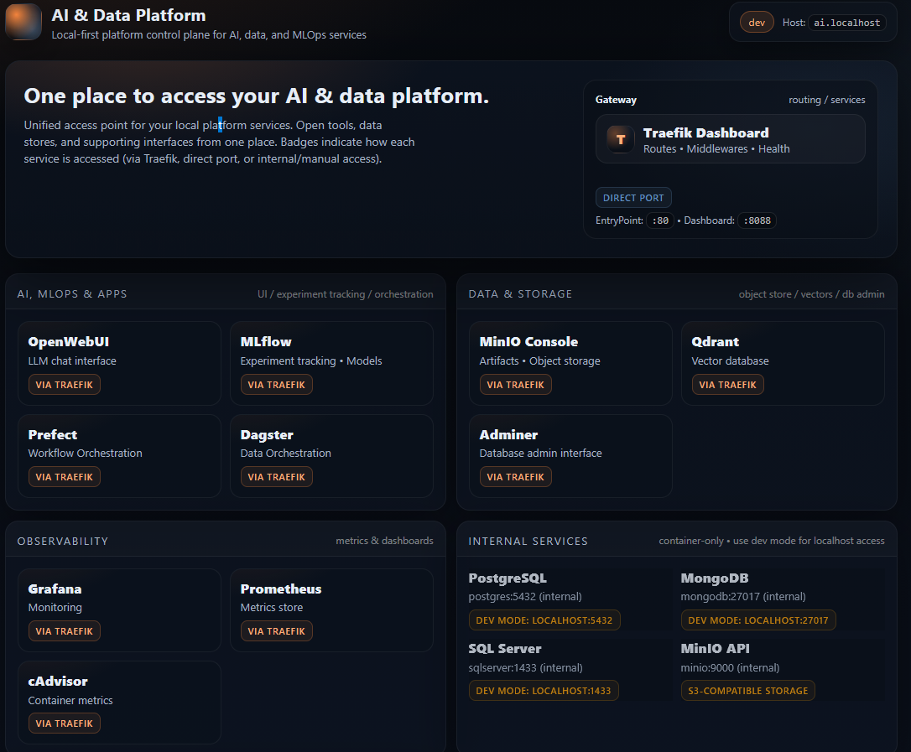
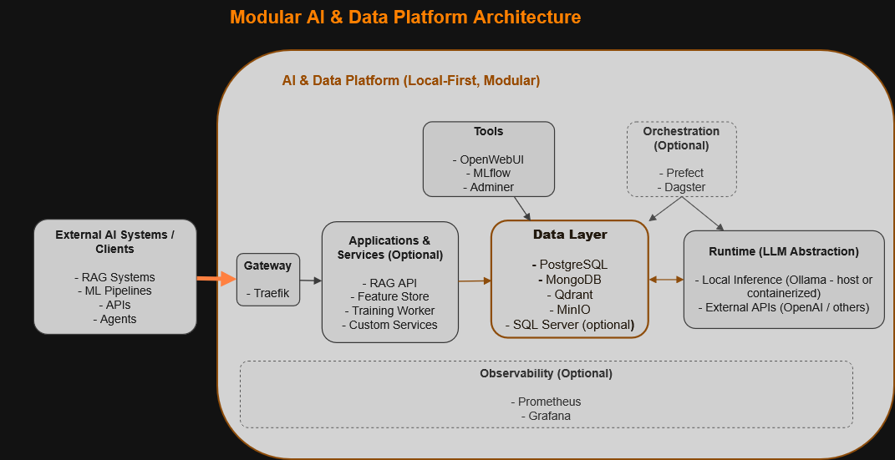

# Modular AI & Data Platform


 

## Overview

This repository provides a local-first, modular AI & Data platform designed for engineers, consultants, and advanced practitioners who want to build real-world AI systems without relying on cloud infrastructure.

It acts as a reusable backbone for:

- RAG pipelines  
- MLOps workflows  
- data engineering  
- agentic systems  
- LLM experimentation  

All services run through Docker Compose with a unified gateway, mirroring production AI platforms while remaining practical for local development.

The architecture follows patterns commonly used in production AI systems, where infrastructure, runtime, and application layers are decoupled, enabling scalability, reuse, and independent evolution of components.

---

## What You Get

Running this platform provides a complete local AI & data environment with:

- relational, document, and vector databases  
- object storage for datasets and artifacts  
- experiment tracking (MLflow)  
- local LLM inference via Ollama or external APIs  
- optional workflow orchestration  
- optional monitoring and observability  

All services are accessible through a unified gateway and can be composed into end-to-end AI workflows.

---

## Platform in Action

The following screenshots show the platform running locally, demonstrating the unified gateway, experiment tracking, and LLM interaction capabilities.

### Platform Dashboard



Unified entry point to all platform services via Traefik routing.


---

## Key Capabilities

- Modular AI and data platform architecture  
- Self-hosted storage, vector search, and artifact infrastructure  
- Experiment tracking and model lifecycle support  
- Local LLM runtime with CPU/GPU or external API options  
- Workflow orchestration and pipeline execution  
- Monitoring and observability support  

---

## Typical Workflow

A typical usage flow looks like:

1. Start the platform using the provided scripts  
2. Connect an external project (e.g. RAG, ML pipeline, or API service)  
3. Use platform services:
   - MLflow for experiment tracking  
   - Qdrant for vector search  
   - PostgreSQL for structured data  
   - MinIO for artifacts  
   - Ollama (or external APIs) for LLM inference  
4. Iterate and experiment locally  
5. Promote validated workflows to cloud or production environments  

This enables a full development lifecycle without relying on external infrastructure.

---

## Why This Platform Exists

Modern AI systems are composed systems involving data pipelines, vector search, model tracking, orchestration, and runtime environments.

Reproducing this architecture typically requires complex cloud setups.

This platform provides a local-first alternative, allowing you to:

- develop and test full AI systems without cloud cost  
- validate architecture decisions before production deployment  
- reuse infrastructure across multiple projects and clients  

---

## Differentiation

Unlike typical AI repositories that focus on individual tools or isolated demos, this platform:

- provides an end-to-end AI infrastructure layer, not just examples  
- supports multiple independent projects through a shared backbone  
- mirrors production architectures while remaining lightweight  
- enables local-first experimentation without cloud dependency  

This positions the platform as a bridge between experimentation and production-grade system design.

### Key Characteristics

| Attribute | Description |
|----------|------------|
| Modular | Compose only the services you need |
| Local-first | No cloud dependency required |
| Production-inspired | Mirrors real AI platform architectures |
| Reusable | Supports multiple external projects |

---

## Who This Is For

| Category | Description |
|---------|-------------|
| Primary | AI/ML Engineers, Data Platform Engineers |
| Secondary | Consultants, Freelancers, Startups |
| Also Valuable | Advanced learners |
| Not For | Beginners, non-technical users |

---

## Architecture Philosophy

| Principle | Description |
|----------|------------|
| Separation | Data, AI, orchestration separated |
| Modular | Compose overlays control services |
| Local-first | Everything runs locally |
| Production-aligned | Real-world patterns |
| Reusable | Connect external projects |

---

## High-Level Architecture




The platform is structured as a modular, layered system where external applications interact through a gateway and optional service layer, while shared infrastructure (data, runtime, and tools) remains decoupled and reusable.

Key concepts illustrated in the diagram:
- External systems connect via the gateway and application/service layer
- The data layer acts as the central backbone for storage and retrieval
- The runtime layer abstracts LLM execution (local or external)
- Orchestration and observability are optional and can be enabled as needed

Full architecture: [docs/ARCHITECTURE.md](docs/ARCHITECTURE.md)

---

## Core Components

| Layer | Technology | Purpose |
|------|-----------|--------|
| Gateway | Traefik | Routing |
| Data | PostgreSQL | Relational |
| Data | MongoDB | Documents |
| Object Storage | MinIO | Files |
| Vector DB | Qdrant | Embeddings |
| ML | MLflow | Experiments |
| Runtime | Ollama | LLM |
| UI | OpenWebUI | Chat |
| Monitoring | Prometheus/Grafana | Metrics |
| Optional | SQL Server | Enterprise |

Each component is independently deployable and connected through a shared network, enabling flexible composition of AI workflows.

### Service Access Pattern

All services are exposed through a unified gateway (Traefik) using local domain routing (e.g. `*.localhost`).

Internal communication between services occurs within the Docker network, while external applications connect via HTTP APIs, database ports, or service endpoints.

This mirrors production architectures where a gateway manages traffic and services remain isolated but interoperable.

**Runtime Abstraction**

The platform abstracts LLM execution from the rest of the system.

Inference can be executed via:

- Local runtime (e.g. Ollama), running either:
  - inside Docker (containerized)
  - on the host machine (common in local-first setups, especially on non-NVIDIA environments)
- External LLM APIs (e.g. OpenAI or other providers)

This enables the same platform architecture to operate across different environments without changes to application logic.

---

## Use Cases

| Use Case | Description |
|---------|-------------|
| RAG | Retrieval systems |
| LLM | Local experimentation |
| MLOps | Tracking |
| Pipelines | Data workflows |
| Orchestration | Automation |
| Pre-cloud | Validation |

These use cases can be combined to support end-to-end AI system development within a single environment.

---

## Design Decisions

### Not Included (v1)

| Category | Tools |
|----------|------|
| Graph DB | Neo4j |
| Streaming | Kafka |
| Ingestion | Airbyte |
| Transform | dbt |
| Agents | MCP |

Reason:
- reduce complexity  
- keep clarity  
- optimize local usage  

---

## Platform Usage Model

The platform supports two primary usage patterns.

### Mode 1: Infrastructure Backbone

External repositories use the platform as a shared infrastructure layer, connecting through APIs, database connections, and service endpoints exposed via the gateway.

This is the recommended approach for:
- RAG systems  
- ML pipelines  
- LLM applications  
- experimentation across independent projects  

Typical external projects include:
- chatbot applications  
- trading or analytics pipelines  
- news or document processing systems  
- ML experimentation environments  

Each project remains independent while leveraging the platform for storage, computation, and AI capabilities.

### Mode 2: Internal Apps

Services can live inside the `/apps` directory.

The `/apps` directory contains optional, platform-integrated services — not the primary purpose of the repository.

Typical examples include:
- RAG APIs
- ingestion pipelines
- training workers
- feature-oriented platform components

---

## Deployment Profiles

Profiles allow you to start only the components required for a specific workflow, reducing resource usage and complexity.

| Profile | Description |
|--------|------------|
| infra | Core services |
| tools | MLflow, UI |
| monitoring | Metrics |
| orchestration | Prefect/Dagster |
| runtime | AI runtime |
| sqlserver | Optional |

SQL Server is available as an optional overlay for enterprise analytics and BI workloads. It is not included in the default startup path to keep local resource usage manageable.

---

## Requirements

Recommended environment and resources:
- Docker Desktop or Docker Engine
- 16 GB RAM recommended
- Windows recommended for the supported script workflow
- Linux / macOS supported through manual Docker Compose usage
- Optional GPU for local LLM acceleration

---

## Starting the Platform

The supported operational surface is the Windows PowerShell scripts in `scripts/windows/`.

Linux and macOS can use the same compose files manually, but the documented quick-start workflow in this repository is Windows-first.


### Quick Start (Recommended)

Start the platform (recommended default setup):

~~~powershell
.\scripts\windows\up-tools.ps1
~~~

Then open:

- http://ai.localhost  

This is the main entry point to the platform, providing access to all services through a unified dashboard.

To see all active services and access URLs:

~~~powershell
.\scripts\windows\list-urls.ps1
~~~

### Development Mode (Direct Data Access)

Use development mode when you need direct access to data services via localhost (e.g. for debugging, local scripts, or external tools).

~~~powershell
.\scripts\windows\down.ps1
.\scripts\windows\up-dev-tools.ps1
~~~

This mode exposes core data services directly on localhost:

- PostgreSQL (5432)
- MongoDB (27017)
- Qdrant (6333)
- MinIO API (9000)

Orchestration services (Prefect, Dagster) expose direct ports only when the orchestration dev overlay is enabled.

---

### Additional Startup Modes

Use these modes when you need additional capabilities beyond the default setup:

Start full platform (including monitoring):

~~~powershell
.\scripts\windows\up-full.ps1
~~~

Start with orchestration (Prefect / Dagster):

~~~powershell
.\scripts\windows\up-orchestration.ps1
~~~

Full platform + orchestration:

~~~powershell
.\scripts\windows\up-full-orchestration.ps1
~~~

These scripts encapsulate the correct Docker Compose files and startup profiles.


### Manual Startup (Docker Compose)

Run the following from the repository root:

Core + tools:

~~~powershell
docker compose --env-file .\config\env\.env `
  -f .\compose\docker-compose.yml `
  -f .\compose\docker-compose.tools.yml `
  --profile infra `
  --profile tools `
  up -d
~~~

Core + tools + orchestration:

~~~powershell
docker compose --env-file .\config\env\.env `
  -f .\compose\docker-compose.yml `
  -f .\compose\docker-compose.tools.yml `
  -f .\compose\docker-compose.orchestration.yml `
  --profile infra `
  --profile tools `
  --profile orchestration `
  up -d
~~~

---

## Next Steps

Once the platform is running:

1. Open the dashboard → http://ai.localhost  
2. Explore available services  
3. Run an example from `/examples`  

For detailed operations and troubleshooting, see:

- `docs/RUNBOOK.md`
- `docs/SERVICES.md`

---

### Service Access Modes

Services can be accessed in two ways:

- **Via Traefik (recommended)** — clean URLs using `*.localhost`
- **Direct ports** — available only for services that publish host ports in the active stack or dev overlays

---

## Accessing Platform Services

Once the platform is running, core services are accessible through local domains and, where enabled, direct host ports.

### Core Services

| Service | Traefik URL | Direct URL | Description |
|--------|-------------|------------|-------------|
| Platform Dashboard | http://ai.localhost | — | Main platform entry point |
| OpenWebUI | http://openwebui.localhost | http://localhost:3000 | LLM chat interface |
| MLflow | http://mlflow.localhost | — | Experiment tracking UI |
| Adminer | http://db.localhost | — | Database administration |
| Traefik Dashboard | — | http://localhost:8088/dashboard/ | Gateway and routing |

### Data & Infrastructure

| Service | Traefik URL | Direct URL | Notes |
|--------|-------------|------------|------|
| MinIO Console | http://minio.localhost | — | Console via Traefik |
| MinIO API | — | http://localhost:9000 | Dev-core overlay only |
| Qdrant | http://qdrant.localhost/dashboard | http://localhost:6333 | Direct port via dev-core overlay |
| PostgreSQL | — | localhost:5432 | Dev-core overlay only |
| MongoDB | — | localhost:27017 | Dev-core overlay only |

### Optional Services (if enabled)

| Service | Traefik URL | Direct URL | Notes |
|--------|-------------|------------|------|
| Grafana | http://grafana.localhost | http://localhost:3001 | Monitoring overlay |
| Prometheus | http://prometheus.localhost | http://localhost:9090 | Monitoring overlay |
| Prefect | http://prefect.localhost | http://localhost:4201 | Dev-orchestration overlay |
| Dagster | http://dagster.localhost | http://localhost:3051 | Dev-orchestration overlay |
| SQL Server | — | localhost:1433 | Dev-sqlserver overlay |

---

### Notes

- Traefik URLs require local domain resolution (`*.localhost`)
- Direct URLs work out-of-the-box without additional configuration
- Internal service names (e.g. `postgres:5432`) are only accessible within Docker

---

## Examples

The platform includes curated example projects that demonstrate how to build end-to-end AI workflows on top of the provided infrastructure.

Each example is self-contained and integrates directly with platform services such as MLflow, Qdrant, PostgreSQL, MinIO, and Ollama.

| Example | Description | Location |
|--------|-------------|----------|
| MLflow Demo | Model training, experiment tracking, and artifact management | `examples/mlflow-demo/README.md` |
| RAG Demo | End-to-end retrieval pipeline using embeddings and vector search | `examples/rag-demo/README.md` |

Examples are located in the `/examples` directory and are intended to showcase practical integration patterns rather than isolated scripts or notebooks.

Examples can be used as starting points for independent projects or extended to support more advanced workflows.

---

## Documentation

Detailed architecture, services, and operations guidance is available in the documentation below.

| Topic | Path |
|------|------|
| Architecture | docs/ARCHITECTURE.md |
| Services | docs/SERVICES.md |
| Runbook | docs/RUNBOOK.md |
| Orchestration | docs/ORCHESTRATION.md |
| Roadmap | docs/ROADMAP.md |

---

## Repository Structure

```text
ai-platform/
│
├─ compose/   # Docker Compose configuration
├─ config/    # Environment and platform configuration
├─ scripts/   # Startup and operational scripts
├─ docs/      # Architecture and operational documentation
├─ examples/  # Example AI workflows (RAG, MLflow, etc.)
├─ apps/      # Optional platform-integrated services
├─ platform/  # Platform-level services and components
├─ README.md  # Project overview
```

Runtime-generated directories such as `volumes/`, `logs/`, `tmp/`, and `backups/` are excluded from version control.

---
## Operational Model

This platform is designed as:

- a local-first development environment
- a reusable infrastructure backbone
- a production-inspired architecture (not production deployment)

All services are:

- containerized via Docker Compose
- accessible via a unified gateway (Traefik)
- loosely coupled and independently replaceable

The platform prioritizes:

- clarity over feature completeness
- modularity over monolithic design
- reproducibility over convenience

---

## Roadmap

| Version | Focus |
|--------|------|
| v2 | Advanced RAG, graph-based retrieval, MCP-style interoperability, cloud deployment variants |
| Future | Expanded examples, improved observability, and evolution toward enterprise-ready architecture |

The platform is designed to evolve toward cloud and enterprise-ready deployments while maintaining its modular architecture.

---

## License

MIT License — Free for personal and commercial use.

See [LICENSE](LICENSE) for details.

---

## Contributing

Open to improvements and extensions.
